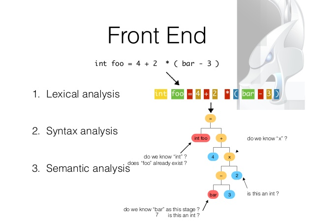

- title : Introduction to Compilers in F#
- author : Dmytro Suvorov
- theme : solarized
- transition : default

***

### Why compilers?

- It is fun
- Everyone needs to know this
- It is (usually) much easier than you think it is
- BTM must live!

***

### Why F#

- It is fun :D
- Language itself is very well suited for compilers
  - based on OCaml
- Has great tools (FsLexYacc, FParsec)
- Targets .NET (familiarity, decent IL)
- Learning F# is good for your mental health :)

***

### Overview of today's presentation

- What we want to write (in the end)
- Quick (and not so accurate) history of PLs
- 10min intro to F#
- A quick intro to how compilers work
- Let's write (in real time) a small interpreter for our language

***

### What we want to write (in the end)

- A simple Rule Engine (similar to how we use CodeEffects)
- Receive some model (object) as an input
- Check some condition, return bool

    not(Amount < 10) and HasTag('vip') = true

---

    [lang=cs]
    public class Model
    {
        public int Amount { get; set; }
        public bool HasTag(string tag) {
            return _tags.Contains(tag);
        }

        public Model(int amount, string[] tags)
        {
            Amount = amount;
            _tags = tags;
        }

        private readonly string[] _tags;
    }

---

    [lang=cs]
    var rule = "not(Amount < 10) and HasTag('vip') = true";
    var compiled = RuleCompiler.Compile<Model>(rule);
    var model = new Model(42, new[] { "vip" });
    var result = compiled(model);
    Console.WriteLine(result);

---

# **DEMO**

***

### Quick (and not so accurate) history of PLs

---

#### 50s-70s

Back in the 50s-70s, programming languages were a BigDeal,
with large investments, upfront planning,
and standardization committees
(Ada is a great example)

---

#### 50s-70s examples

- **Fortran**, 50s, originally developed by IBM as part of their core business in computing machines.
- **Cobol**, late 50s, designed by a large committee from the onset, sponsored by the DoD.
- **Lisp**, late 50s, main project occupying 2 professors at MIT and their students,
  with the grand goal of producing an algebraic list processing language for artificial intelligence work, also funded by the DoD.
- **C**, early 70s, part of the large investment that Bell Labs was doing in the development of Unix.
- **Smalltalk**, early 70s, part of a large investment that Xerox did in "inventing the future" of computers.

---

#### 80s

Things have changed dramatically during the 80s.

- Decent middle-level languages (C, Pascal) became very popular.
- Parsing and lexing were considered a solved problem.
- A lot of good and well-tested tools were written.

---

#### 90s

Since the 90s, a considerable percentage of new languages
that ended up being very popular were designed by lone programmers,
some of them kids with no research inclination, some as a side hobby.

---

#### 90s examples

- **PHP**, by Rasmus Lerdorf, 1994, originally used for tracking visits to his online resume
- **JavaScript**, by Brendan Eich, 1995, "Plus, I had to be done in ten days or something worse than JS would have happened."
- **Python**, by Guido van Rossum, 1990, "I was looking for a 'hobby' programming project"
- **Ruby**, by Yukihiro 'Matz' Matsumoto, 1994, "I wanted a scripting language that was more powerful than Perl"

***

### Moral of the story

There is a lot of fun in designing new languages,
but this fun is not an exclusive right of researchers with Ph.Ds.

---

Given all the knowledge about programming languages these days, anyone can do it.

---

And many do.

Go ahead and write something ;)

It *will* be fun!

***

### 10min intro to F#

    // The "let" keyword defines an (immutable) value
    let myInt = 5
    let myFloat = 3.14
    let myString = "hello"   //note that no types needed

---

    // ======== Lists =========
    let oneToFive = [1;2;3;4;5]
    List.map ((+) 2) oneToFive // [3;4;5;6;7]
    List.reduce (+) oneToFive // 15

---

    // ======== Functions ========
    let square x = x * x
    square 3
    // In F# there is no "return" keyword. A function always
    // returns the value of the last expression used.

    let add x y =     // F# is indentation-based language
        x + y         // (like Python and Haskell)
    add 2 3

    let add1 = add 1
    add1 10

---

    // ====== Pipes =======
    square 3
    3 |> square
    3 |> square |> add 10

    // sumOfSquaresTo100
    List.sum ( List.map square [1..100] )

    [1..100] |> List.map square |> List.sum
    [1..100] |> List.map (fun x-> x * x) |> List.sum

---

    // ========= Complex Data Types =========

    //tuples are quick 'n easy anonymous types
    let twoTuple = (1, 2)
    let threeTuple = ("a", 2, true)

    //record types have named fields
    type Person = { First:string; Last:string }
    let person1 = { First="john"; Last="Doe" }

    //union types have choices
    type Temp =
        | DegreesC of float
        | DegreesF of float
    let temp = DegreesF 98.6

---

    // ======== Pattern Matching ========

    // Match..with.. is a supercharged case/switch statement.
    let printTemp temp =
        match temp with
            | DegreesF f -> printfn "%f degrees F" f
            | DegreesC c -> printfn "%f degrees C" c

    let printTemp' = function
        | DegreesF f -> printfn "%f degrees F" f
        | DegreesC c -> printfn "%f degrees C" c

***

### A quick intro to how compilers work

---

#### Frontend

---

#### Backend

---

### Always start in the middle!

- More freedom to experiment
  - Your choice of AST will always be wrong :)
  - You want to iterate quickly
- Changing Interpreter is easy
- Changing Parser and Code Generator is hard

---

And you may find out that you don't even need an
external language.

Internal DSL may serve your goal pretty well.

***

### Let's write (in real time) a small interpreter for our language

---

    // not(Amount < 10) and HasTag('vip') = true
    type complexBoolExp =
        | And of complexBoolExp list
        | Or of complexBoolExp list
        | Not of complexBoolExp
        | Comparison of valueExp * op * valueExp
    and op = Eq | Lt | Gt
    and identifier = string
    and valueExp =
        | Constant of constant
        | Property of identifier
        | Func of identifier * valueExp list
    and constant =
        | Int of int
        | String of string
        | Bool of bool

---

    // Amount < 10
    let checkAmount = Comparison(
        Property "Amount",
        Lt,
        Constant(Int 10))
    // HasTag('vip') = true
    let hasVipTag = Comparison(
        Func("HasTag", [Constant(String "vip")]),
        Eq,
        Constant(Bool true))
    // not(Amount < 10) and (HasTag('vip') = true)
    let complexExp = And([Not(checkAmount); hasVipTag])

***

# **CODING TIME!**
